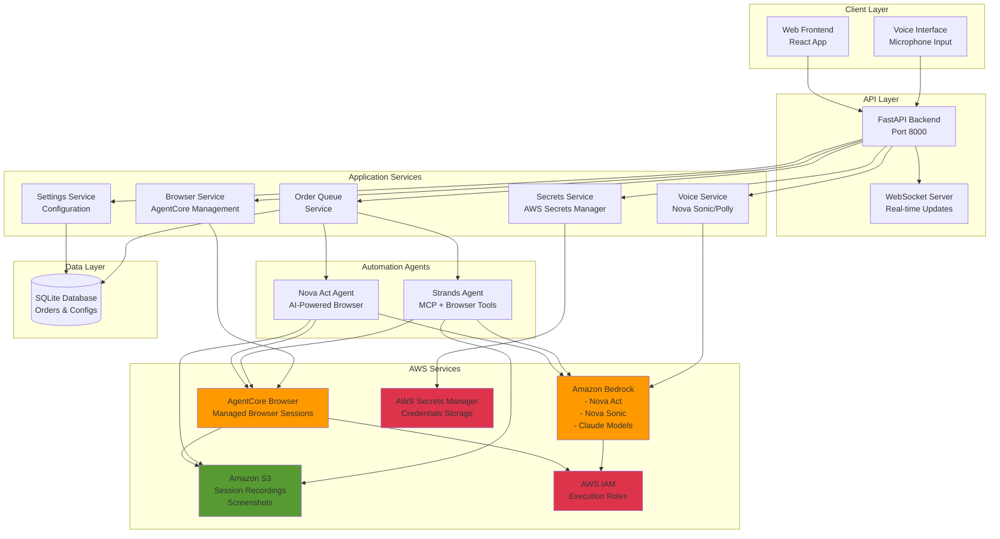
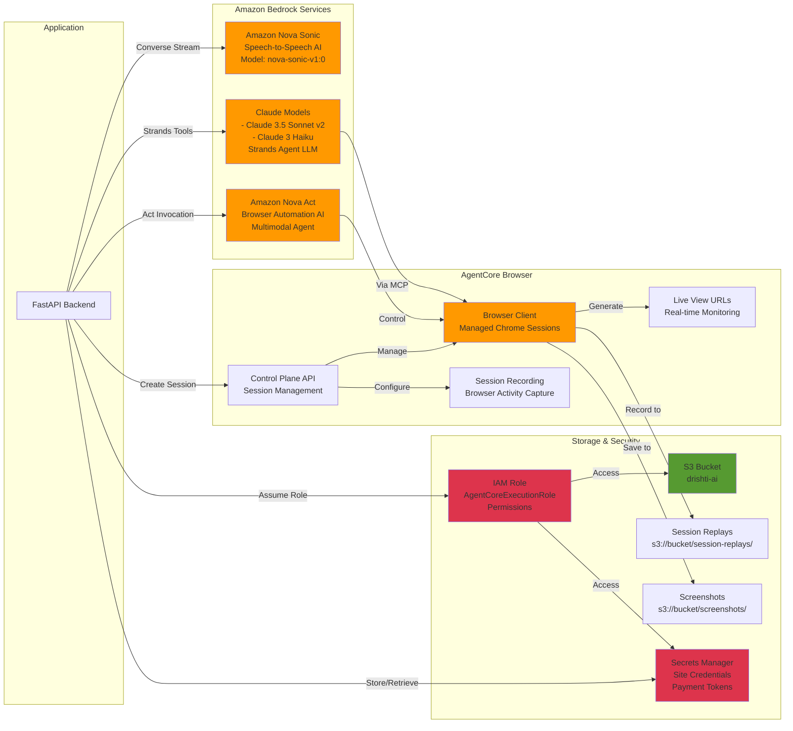
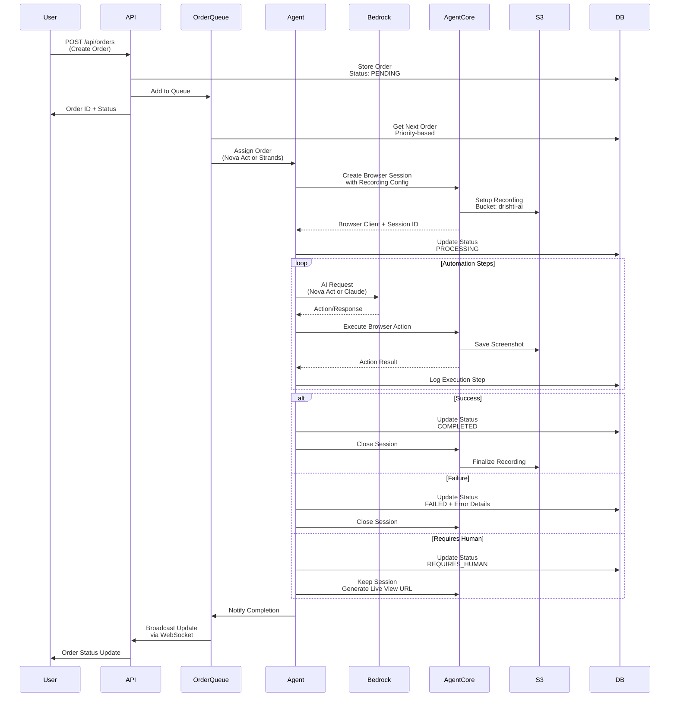
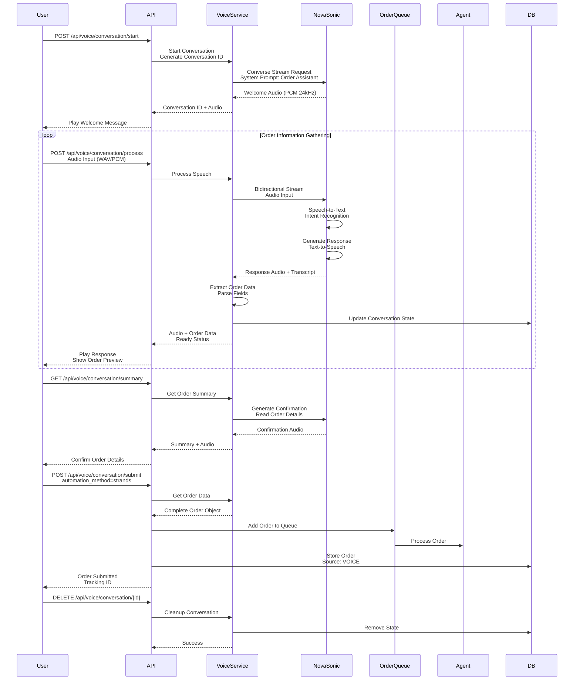
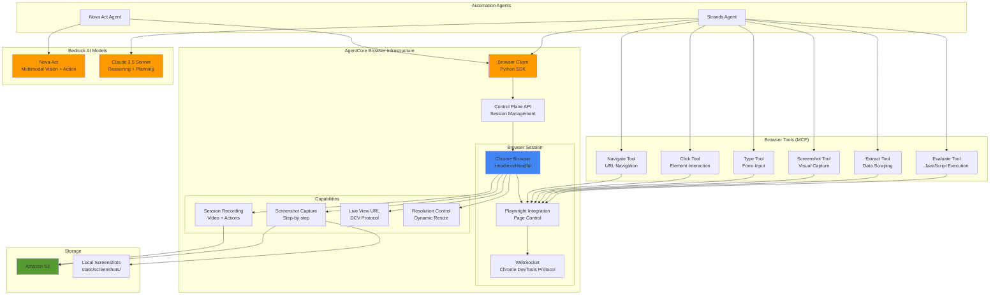
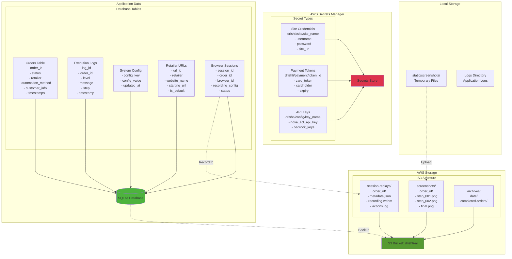
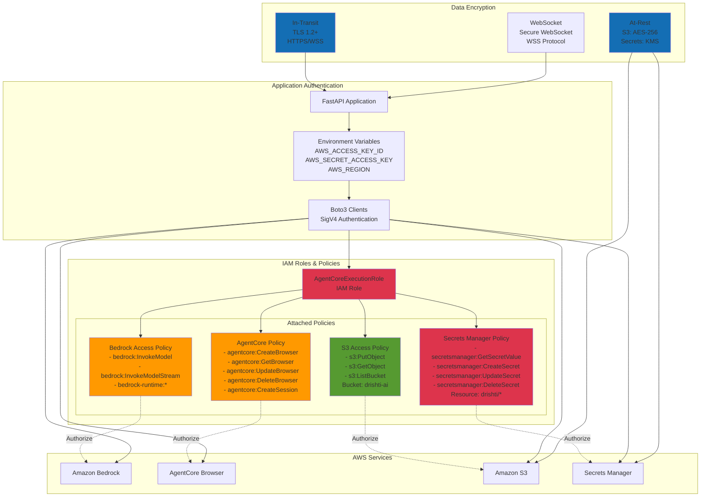

# AWS Architecture Diagrams - Drishti AI Navigator

## Table of Contents
1. [High-Level System Architecture](#1-high-level-system-architecture)
2. [AWS Services Integration](#2-aws-services-integration)
3. [Order Processing Flow](#3-order-processing-flow)
4. [Voice Conversation Flow](#4-voice-conversation-flow)
5. [Browser Automation Architecture](#5-browser-automation-architecture)
6. [Data Flow & Storage](#6-data-flow--storage)
7. [Security & IAM](#7-security--iam)

---

## 1. High-Level System Architecture



---

## 2. AWS Services Integration



---

## 3. Order Processing Flow



---

## 4. Voice Conversation Flow



---

## 5. Browser Automation Architecture



---

## 6. Data Flow & Storage



---

## 7. Security & IAM



---

## Architecture Components Summary

### Core AWS Services Used

| Service | Purpose | Configuration |
|---------|---------|---------------|
| **Amazon Bedrock** | AI Models (Nova Act, Nova Sonic, Claude) | Region: us-west-2 |
| **AgentCore Browser** | Managed browser automation | Control Plane + Browser Client |
| **Amazon S3** | Session recordings, screenshots | Bucket: drishti-ai |
| **AWS Secrets Manager** | Credentials storage | Prefix: drishti/* |
| **AWS IAM** | Access control & permissions | Role: AgentCoreExecutionRole |

### Automation Methods

1. **Nova Act Agent**
   - Uses Amazon Nova Act multimodal AI
   - Direct browser control via AgentCore
   - Visual understanding + action planning
   - Best for complex, adaptive scenarios

2. **Strands Agent**
   - Uses Claude 3.5 Sonnet for reasoning
   - Browser Tools via MCP (Model Context Protocol)
   - Structured tool-based interactions
   - Best for deterministic workflows

### Key Features

- **Voice Ordering**: Nova Sonic speech-to-speech conversations
- **Live View**: Real-time browser session monitoring
- **Session Replay**: S3-stored browser recordings
- **Manual Control**: Human intervention capability
- **Priority Queue**: Intelligent order processing
- **Real-time Updates**: WebSocket-based notifications
- **Credential Management**: Secure storage in Secrets Manager

### Network Architecture

```
User → [HTTPS] → FastAPI (Port 8000)
       ↓
       WebSocket (Port 8000)
       ↓
[TLS] → AWS Services
       - Bedrock Runtime
       - AgentCore Control Plane
       - S3
       - Secrets Manager
```

### Data Retention

- **Database**: Local SQLite (persistent)
- **Screenshots**: S3 (30-day lifecycle)
- **Session Replays**: S3 (configurable retention)
- **Secrets**: Secrets Manager (30-day recovery window)

---

## Deployment Considerations

### Prerequisites
1. AWS Account with Bedrock access
2. IAM role with necessary permissions
3. S3 bucket for recordings
4. Python 3.11+ environment

### Environment Variables
```bash
AWS_REGION=us-west-2
AWS_ACCESS_KEY_ID=<your-key>
AWS_SECRET_ACCESS_KEY=<your-secret>
AGENTCORE_REGION=us-west-2
SESSION_REPLAY_S3_BUCKET=drishti-ai
```

### Scaling Recommendations
- **Horizontal**: Multiple FastAPI instances behind load balancer
- **Vertical**: Increase worker threads for order queue
- **Browser Sessions**: Monitor AgentCore browser limits
- **S3 Storage**: Implement lifecycle policies for cost optimization

---

*Generated: October 2025*
*Application: Drishti AI Navigator - AWS AI Agent Global Hackathon*
